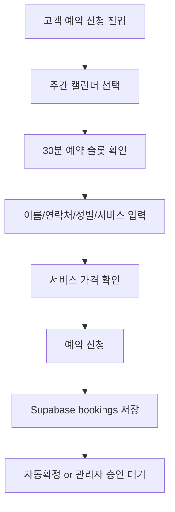
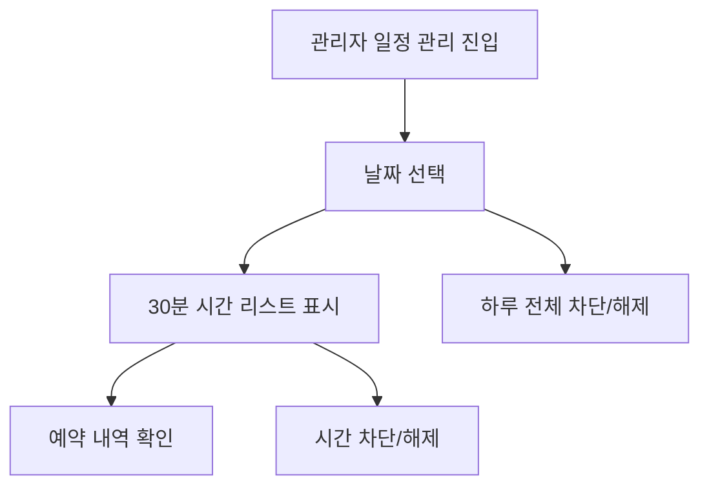
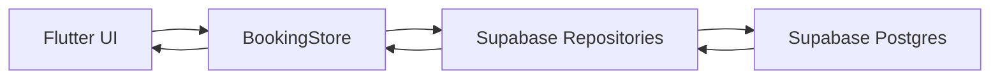

# Salon Booking

Flutter 기반 미용실 예약 관리 시스템입니다. 고객 예약 신청, 관리자 일정/차단 관리, Supabase 연동을 포함합니다.

## 기술 스택

- Flutter (Web, iOS, Android)
- Dart
- Supabase (Postgres, Auth, Storage)
- Vercel (Web 배포)

## 시스템 개요

- 고객 예약 신청 화면 (카테고리/다중 서비스 선택)
- 주간 캘린더 + 30분 슬롯 예약
- 공휴일/일요일 강조 표시 및 조기 마감(17:30)
- 예약/차단 상태에 따라 예약 가능 여부 자동 처리
- 관리자 일정 관리에서 날짜별 예약 리스트 확인
- 전체 차단 및 시간대 차단 지원
- 서비스/가격 데이터 Supabase 연동

## Flow

### 고객 예약 흐름



### 관리자 일정 관리 흐름



### 데이터 연동 흐름



## 데이터 모델

- bookings
- booking_items
- services
- blocked_slots

## 환경 변수

- SUPABASE_URL
- SUPABASE_ANON_KEY

## Supabase SQL

- `supabase/booking_schema.sql`
- `supabase/booking_items_schema.sql`
- `supabase/services_schema.sql`
- `supabase/blocked_slots_schema.sql`

## 실행

```bash
flutter pub get
flutter run -d chrome \
  --dart-define=SUPABASE_URL=YOUR_URL \
  --dart-define=SUPABASE_ANON_KEY=YOUR_KEY
```

## 배포

Vercel에서 Flutter Web 빌드 후 `build/web` 디렉토리를 배포 대상으로 설정합니다.
